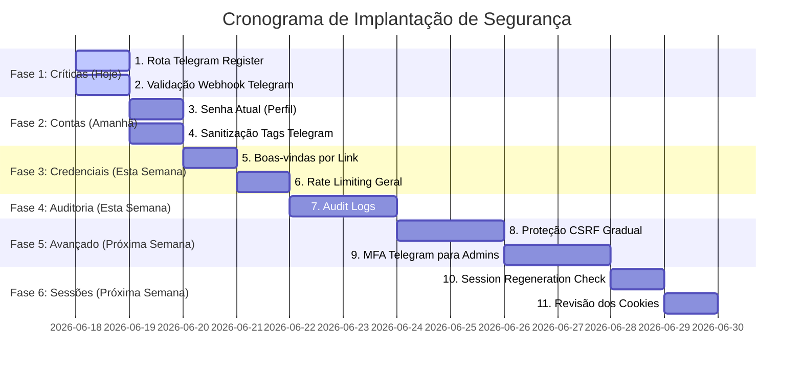

# Plano de Ação para Correção e Melhoria de Cyber Segurança — CP Agenda Pro

> **Atenção:** Este plano de ação foi desenhado para um sistema em produção com clientes reais ativos. Todas as modificações no banco de dados e fluxos de autenticação mantêm a compatibilidade reversa para evitar interrupções do serviço ou indisponibilidade da agenda dos profissionais.

---

## 📅 Cronograma de Execução Phased ( Release Plan )

---

## Detalhamento das 11 Ações Técnicas

### 🔴 FASE 1 — Correções Críticas (Urgência Imediata)

#### 1. Proteção da Rota Telegram Register
*   **Arquivo:** `backend/api/index.php`
*   **Problema:** A rota `/api/telegram-register` é pública e pode ser chamada por qualquer requisição HTTP GET sem autenticação, usando `$_SERVER['HTTP_HOST']` dinâmico para registrar o webhook de toda a plataforma.
*   **Correção:**
    *   Exigir autenticação administrativa de `super_admin` para executar a rota.
    *   Utilizar domínio fixo `APP_DOMAIN` configurado no `.env` do servidor de produção ao invés do host header dinâmico.
*   **Impacto:** Risco operacional nulo. Nenhum cliente final utiliza esta rota administrativa de setup.

#### 2. Validação do Webhook Telegram
*   **Arquivo:** `backend/api/routes/telegram_webhook.php` e `backend/api/index.php`
*   **Problema:** O endpoint `/api/telegram-webhook` não valida se a chamada veio genuinamente do Telegram, permitindo simulação de comandos e roubo de notificações.
*   **Correção:**
    *   Gerar chave secreta de 256 bits (`WEBHOOK_SECRET`) no `.env`.
    *   Repassar essa chave no registro do webhook (`secret_token`) na API do Telegram.
    *   Validar o cabeçalho `X-Telegram-Bot-Api-Secret-Token` no início do processamento usando `hash_equals()`.
*   **Impacto:** Requer que o Super Admin execute a rota `/api/telegram-register` (agora autenticada) uma única vez após o deploy para atualizar as configurações no Telegram.

---

### 🟠 FASE 2 — Proteção de Contas (Médio Prazo - 24 a 48 Horas)

#### 3. Validação da Senha Atual
*   **Arquivo:** `backend/api/routes/me.php` e `components/AccountTab.tsx`
*   **Problema:** O endpoint `/api/me/change-password` altera a senha exigindo apenas a sessão ativa, sem solicitar a senha antiga.
*   **Correção:**
    *   **Backend:** Modificar a rota para exigir o campo `current_password` e validá-lo contra o banco de dados usando `password_verify()`.
    *   **Frontend:** Inserir o campo de senha atual no modal de alteração de senha no perfil do cliente.
*   **Impacto:** Requer deploy conjunto de frontend e backend. Sem alteração estrutural no banco de dados.

#### 4. Sanitização das Mensagens Telegram
*   **Arquivo:** `backend/api/routes/appointments.php`
*   **Problema:** Nomes de clientes ou serviços com caracteres especiais (como `<` ou `&`) falham o envio de alertas por violação de tags HTML do Telegram.
*   **Correção:**
    *   Aplicar a função `htmlspecialchars()` nos campos de entrada `clientName` e `serviceName` antes de montar a mensagem de notificação.
*   **Impacto:** Nulo. Nenhuma alteração funcional para os usuários finais.

---

### 🟠 FASE 3 — Correções de Exposição de Credenciais (Esta Semana)

#### 5. Substituição de Senha por Link de Primeiro Acesso
*   **Arquivo:** `backend/api/routes/admin.php`
*   **Problema:** Senhas temporárias são geradas e enviadas por e-mail em texto limpo, gerando histórico permanente exposto.
*   **Correção:**
    *   Alterar criação de conta em `admin.php` para gerar um `reset_token` de primeiro acesso de 48 horas.
    *   Enviar por e-mail apenas o link `/reset-password?code=TOKEN` para que o profissional defina sua senha no primeiro acesso.
*   **Impacto:** Afeta apenas o onboarding de novos usuários. Sem impacto em contas existentes.

#### 6. Rate Limiting
*   **Arquivo:** `backend/api/routes/auth.php`
*   **Problema:** Garantir proteção contra força bruta em todas as rotas de autenticação.
*   **Correção:**
    *   Garantir a integridade do rate limit no login,forgot-password e reset-password.
*   **Impacto:** Apenas conexões robóticas abusivas serão bloqueadas.

---

### 🟡 FASE 4 — Auditoria e Rastreabilidade (Esta Semana)

#### 7. Audit Logs
*   **Ação:** Rastreamento pós-incidente e auditoria de ações administrativas.
*   **Correção:**
    *   Criar migração SQL `0017_create_audit_logs.sql` para registrar eventos em tabela isolada.
    *   Gravar logs automáticos em operações críticas: logins, logouts, trocas de senha, exclusão de clientes, alteração de planos e faturas.
*   **Impacto:** Nulo. Adição segura e isolada.

---

### 🟡 FASE 5 — Proteções Avançadas (Próxima Semana)

#### 8. Proteção CSRF
*   **Ação:** Prevenir ataques de execução de comandos cross-site.
*   **Estratégia:**
    *   Implantar de forma gradual: fase 1 apenas loga ou aceita requisições sem o cabeçalho `X-CSRF-Token` para evitar quebras por cache de sessões antigas; fase 2 torna o token obrigatório após confirmação de conformidade do frontend.

#### 9. MFA para Administradores
*   **Ação:** Proteger contas administrativas contra vazamento de senhas.
*   **Correção:**
    *   Enviar PIN de 6 dígitos via Telegram conectado para contas com permissões administrativas (`admin` / `super_admin`) durante o login.

---

### 🟡 FASE 6 — Revisão de Sessões (Próxima Semana)

#### 10. Session Regeneration
*   **Ação:** Confirmar a regeneração de identificadores após autenticação.
*   **Status:** Mitigado. Confirmado a execução de `session_regenerate_id(true)` no login do `Auth.php`.

#### 11. Revisão dos Cookies
*   **Ação:** Assegurar que os cookies operem estritamente sob as flags recomendadas.
*   **Status:** Mitigado. `HttpOnly=true`, `Secure=true` e `SameSite=Lax` já estão configurados no array de parâmetros da sessão.
