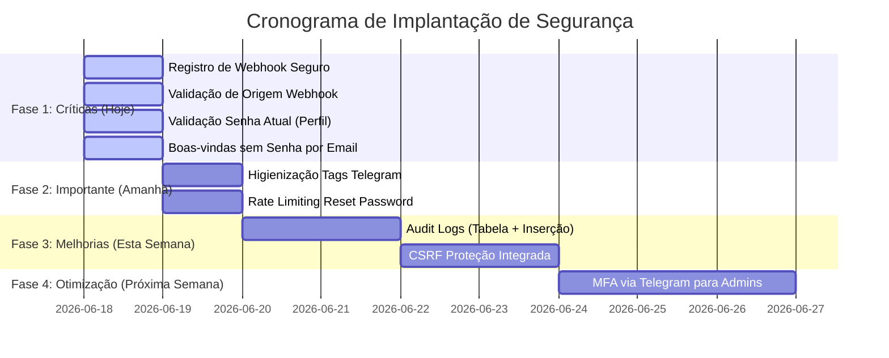

# Plano de Ação para Correção e Melhoria de Cyber Segurança — CP Agenda Pro

> **Atenção:** Este plano de ação foi desenhado para um sistema em produção com clientes reais ativos. Todas as modificações no banco de dados e fluxos de autenticação devem manter a compatibilidade reversa para evitar qualquer interrupção do serviço ou indisponibilidade da agenda dos profissionais.

---

## 📅 Cronograma de Execução Phased ( Release Plan )



---

## Detalhamento das Ações Técnicas

### 🔴 FASE 1: Correções Críticas (Urgência Imediata)

#### 1. Registro de Webhook Seguro (`index.php`)
*   **Ação:** Proibir chamadas anônimas e Host Header Injection em `/api/telegram-register`.
*   **Passos:**
    1.  Adicionar chamada para `Auth::requireAuth()` e validar se `role === 'super_admin'`.
    2.  No arquivo `.env` de produção, adicionar a variável `APP_DOMAIN=cpagendapro.creativeprintjp.com`.
    3.  Alterar `index.php` para usar `get_env_var('APP_DOMAIN')` ao invés de `$_SERVER['HTTP_HOST']`.
*   **Segurança em Produção:** Sem impacto para os profissionais. A rota é de uso exclusivo do administrador do sistema para setup do bot.

#### 2. Validação de Origem do Webhook (`telegram_webhook.php`)
*   **Ação:** Prevenir payloads falsos fingindo ser atualizações do Telegram.
*   **Passos:**
    1.  Gerar um token aleatório forte no servidor e salvá-lo no `.env` como `WEBHOOK_SECRET=token_secreto_aqui`.
    2.  Atualizar o script de registro no backend para repassar o parâmetro `secret_token` no setWebhook da API do Telegram.
    3.  No início de `telegram_webhook.php`, verificar se o header HTTP `X-Telegram-Bot-Api-Secret-Token` confere com a variável `WEBHOOK_SECRET` usando a função segura `hash_equals()`.
*   **Segurança em Produção:** Requer que o Super Admin execute a rota `/api/telegram-register` (agora autenticada) uma única vez após o deploy para atualizar as configurações de webhook no servidor do Telegram.

#### 3. Validação de Senha Atual no Perfil (`me.php` / Frontend)
*   **Ação:** Impedir que invasores com sessões ativas roubadas tomem a conta permanentemente (Account Takeover).
*   **Passos:**
    1.  **Backend:** No arquivo `me.php` (rota `/me/change-password`), receber o campo `current_password` no JSON. Buscar o hash atual da tabela `cp_agenda_users` e usar `password_verify($currentPassword, $hash)` antes de gravar a nova senha.
    2.  **Frontend:** No componente React `AccountTab.tsx`, adicionar o campo de input "Senha Atual" no formulário e passá-lo na chamada HTTP para a API.
*   **Segurança em Produção:** Requer deploy síncrono de frontend e backend. Nenhum impacto em bancos de dados existentes.

#### 4. Fluxo de Boas-Vindas sem Senha por E-mail (`admin.php`)
*   **Ação:** Eliminar o envio de senhas em texto claro por e-mail no ato de criação da conta.
*   **Passos:**
    1.  Em `admin.php`, ao criar o usuário profissional com `POST /admin/users`, remover a geração de senha aleatória em texto limpo.
    2.  Gerar um `reset_token` dinâmico e data de expiração de 48 horas, inserindo diretamente no registro de banco daquele profissional.
    3.  Alterar o e-mail de boas-vindas: em vez de listar a senha em texto plano, exibir o botão/link seguro `/reset-password?code=TOKEN`.
*   **Segurança em Produção:** O profissional criará sua própria senha de acesso na primeira navegação. Fluxo compatível com a página de redefinição de senha já integrada no React.

---

### 🟠 FASE 2: Correções Importantes (Curto Prazo - 24 a 48 Horas)

#### 5. Escapar Inputs no Telegram (`appointments.php`)
*   **Ação:** Prevenir falhas de envio de alertas (Bad Request) e spoofing de mensagens.
*   **Passos:**
    1.  No script de criação de agendamento, aplicar a função nativa `htmlspecialchars($variable, ENT_QUOTES | ENT_HTML5, 'UTF-8')` nos campos de entrada `clientName` e `serviceName` antes de montar o corpo HTML do Telegram.
*   **Segurança em Produção:** Totalmente transparente, risco zero de efeitos colaterais.

#### 6. Rate Limiting no Reset de Senha (`auth.php`)
*   **Ação:** Mitigar força bruta e abuso de recursos no endpoint de alteração de senha por código.
*   **Passos:**
    1.  Adicionar no endpoint `/auth/reset-password` a validação de rate limit baseada em IP e código utilizando a biblioteca de arquivos já existente.
*   **Segurança em Produção:** Proteção de backend sem impacto na interface.

---

### 🟡 FASE 3: Melhorias Estruturais (Esta Semana)

#### 7. Criação de Logs de Auditoria (Audit Logs)
*   **Ação:** Registrar ações administrativas críticas para auditoria forense.
*   **Passos:**
    1.  Criar uma migração SQL `0017_create_audit_logs.sql`:
        ```sql
        CREATE TABLE IF NOT EXISTS `cp_agenda_audit_logs` (
            `id` INT AUTO_INCREMENT PRIMARY KEY,
            `user_id` INT DEFAULT NULL,
            `account_id` INT DEFAULT NULL,
            `ip` VARCHAR(45) NOT NULL,
            `user_agent` VARCHAR(255) NOT NULL,
            `action` VARCHAR(255) NOT NULL,
            `created_at` TIMESTAMP DEFAULT CURRENT_TIMESTAMP
        ) ENGINE=InnoDB DEFAULT CHARSET=utf8mb4;
        ```
    2.  Escrever uma classe auxiliar de auditoria no backend (`Audit.php` na pasta `lib/`) para gravar os logs.
    3.  Registrar os eventos em operações de login (sucesso/falha), logout, alteração de senha, exclusão de agendamentos em lote, deleção de profissionais e alteração de planos.

#### 8. Proteção Anti-CSRF
*   **Ação:** Adicionar cabeçalho de proteção contra falsificação de requisições cross-site.
*   **Passos:**
    1.  Gerar um token de sessão exclusivo (`$_SESSION['csrf_token']`) na inicialização da autenticação.
    2.  Retornar o token no JSON de login/me para o frontend React.
    3.  Configurar o frontend para injetar o token no cabeçalho `X-CSRF-Token` em todas as requisições do Axios.
    4.  No backend, validar o cabeçalho contra o token da sessão para chamadas de alteração de estado (POST, PUT, DELETE, PATCH).

---

### 🟡 FASE 4: Otimização de Login (Próxima Semana)

#### 9. Autenticação Multifator (MFA) via Telegram
*   **Ação:** Bloquear invasões de contas críticas de Super Admin e Admin usando o Telegram conectado.
*   **Passos:**
    1.  Criar uma configuração de segurança "Ativar MFA via Telegram" nas preferências da conta.
    2.  Ao autenticar com e-mail/senha, se o MFA estiver ativo, o backend gera um código PIN temporário de 6 dígitos, envia via Telegram para o `chat_id` conectado do profissional e exige a digitação desse código na tela de login para liberar a sessão.
