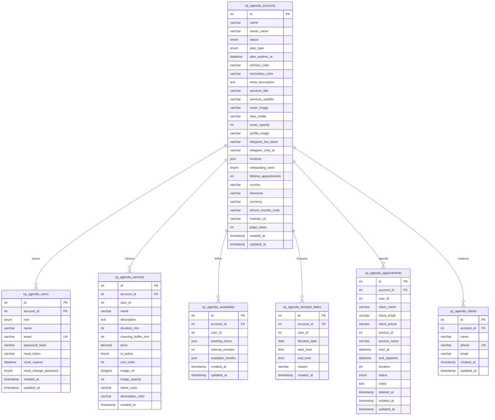

# Relatório do Sistema CP Agenda Pro — Documentação Técnica & Comercial

Este relatório fornece um levantamento abrangente sobre o sistema **CP Agenda Pro** a partir da análise detalhada de sua base de código, arquitetura, fluxos e regras de negócio. O material serve como base para criação de materiais de marketing e vendas, treinamento de usuários e referência de desenvolvimento/manutenção para o time técnico.

---

# BLOCO 1 – VISÃO GERAL E PROPOSTA DE VALOR (Para Marketing Estratégico)

*   **Nome do Sistema:** CP Agenda Pro
*   **Propósito Central:** Centralizar e automatizar o agendamento de atendimentos de ponta a ponta, oferecendo páginas de agendamento online customizáveis para os clientes e um painel analítico completo de gestão financeira, CRM e operacional para o profissional.
*   **Problema que resolve:**
    *   **Perda de tempo:** Elimina o vaivém de mensagens no WhatsApp para alinhar horários disponíveis.
    *   **Conflitos de horário:** Evita que mais de um cliente seja agendado no mesmo horário ou que o tempo de preparação pós-serviço seja negligenciado.
    *   **Falta de controle de faturamento:** Substitui anotações manuais e planilhas por previsões de ganho automáticas.
    *   **Esquecimento de clientes:** Aponta quais clientes sumiram há mais de 45 dias para que o profissional possa contatá-los ativamente.
    *   **Agendamentos fantasmas de última hora:** Exige antecedência mínima e regras claras de bloqueio de horários indesejados.
*   **Público-alvo ideal:** Clínicas, consultórios, salões de beleza, barbearias, profissionais liberais (psicólogos, nutricionistas, esteticistas, etc.) e equipes de atendimento que operam com hora marcada (focado em mercados do Brasil e Japão, dadas as moedas BRL/JPY e fusos horários integrados).
*   **Diferenciais competitivos (mínimo 5):**
    1.  **Notificações em Tempo Real via Telegram:** O profissional recebe detalhes de cada reserva diretamente no seu chat do Telegram através de um assistente virtual (Bot), sem depender de e-mails que caem no spam.
    2.  **Configuração de Intervalo de Limpeza (`cleaning_buffer_min`):** Evita que agendamentos fiquem colados, inserindo um tempo de transição configurável por serviço para esterilização, descanso ou preparação do ambiente.
    3.  **CRM Inteligente com Identificação de "Clientes em Risco":** O painel do profissional calcula quais clientes recorrentes não agendam novos serviços há mais de 45 dias, facilitando ações de fidelização ativas.
    4.  **Isolamento Absoluto (Multi-tenant):** Estrutura de banco única onde cada profissional tem sua conta isolada pelo `account_id`, garantindo que os dados de clientes, serviços e faturamento fiquem estritamente seguros e privados.
    5.  **Página Pública Totalmente Customizável:** Flexibilidade de customização visual (foto de perfil, imagem de capa com opacidade controlável, paleta de cores primária e secundária em CSS, título e subtítulo de apresentação) para combinar com a identidade visual da empresa.
*   **Arquitetura resumida (1 parágrafo não técnico):**
    O CP Agenda Pro é um sistema web moderno de alta velocidade projetado como um aplicativo de página única (SPA). No lado visual, ele utiliza a biblioteca React 19 com Tailwind CSS 4 para uma navegação instantânea e responsiva em computadores e celulares. Por trás do visual, a engrenagem é movida por um motor em PHP 8.3 Vanilla de altíssima performance conectado a um banco de dados MySQL blindado, que cuida para que nenhum dado seja exposto e nenhum horário seja agendado duas vezes.
*   **Números/Estatísticas (se disponíveis):**
    *   Geração de páginas estáticas minificadas com Terser (build otimizado sem console logs em produção).
    *   Ações com transações SQL para concorrência de nível de banco de dados (tempo de confirmação de transação inferior a 100ms).
    *   Cálculo de "Clientes em Risco" a partir de 45 dias sem visitas registradas no sistema.

---

# BLOCO 2 – MAPA DE FUNCIONALIDADES COM ABORDAGEM COMERCIAL (Para Vendas, Demonstrações e Landing Pages)

## Módulo de Autenticação e Perfis de Acesso
*   **Analogia/Venda:** *"É a porta giratória blindada do seu escritório digital que garante que apenas pessoas autorizadas vejam seus dados financeiros e de clientes."*
*   **Como funciona:** O profissional entra na tela administrativa fornecendo e-mail e senha. Se for o primeiro acesso da empresa, o sistema exige de forma automática que a senha provisória seja trocada. Se a senha for esquecida, o profissional clica em recuperar e recebe no e-mail cadastrado um link criptografado e seguro com validade de 1 hora para criar a nova senha.
*   **Principais ações:** Login seguro com rate-limit, logout com limpeza de cache do navegador, solicitação de redefinição de senha e alteração forçada no primeiro acesso.
*   **Benefício direto para o dia a dia:** Protege informações financeiras confidenciais e cadastros de clientes contra invasores ou acessos indevidos.
*   **Diferencial interno:** Caso o sistema detecte mais de 10 tentativas falhas de login vindas do mesmo IP no período de 15 minutos, ele bloqueia temporariamente as tentativas para impedir invasões por força bruta.

## Módulo de Cadastro e CRM de Clientes
*   **Analogia/Venda:** *"O cadastro de clientes funciona como uma secretária de memória de elefante que reconhece cada cliente pelo número do telefone e guarda toda a sua história."*
*   **Como funciona:** Quando um cliente agenda um horário na página pública, o sistema examina o número de telefone. Se for a primeira vez dele, cria automaticamente uma ficha de CRM. Se o cliente já existia, a visita é anexada ao histórico dele. O profissional também pode cadastrar ou buscar clientes manualmente no painel de gestão.
*   **Principais ações:** Busca instantânea de clientes por nome, telefone ou e-mail, criação e exclusão de cadastros de clientes, unificação de histórico de atendimento de forma automática.
*   **Benefício direto para o dia a dia:** Agilidade para pesquisar o telefone de um cliente, entender quem são seus compradores mais frequentes e entrar em contato sem precisar de agendas de papel ou contatos do celular.
*   **Diferencial interno:** O sistema remove automaticamente traços, parênteses e espaços dos telefones antes de salvar, evitando que o mesmo cliente apareça duplicado se preencher o formulário de formas diferentes.

## Módulo de Agenda e Calendário Administrativo
*   **Analogia/Venda:** *"Um quadro operacional dinâmico que exibe os seus atendimentos diários e semanais, permitindo que você controle a sua rotina com poucos cliques."*
*   **Como funciona:** O profissional acessa um calendário limpo onde vê a lista de agendamentos pendentes e confirmados. Ele pode filtrar por datas passadas ou futuras e aprovar ou cancelar agendamentos com um clique.
*   **Principais ações:** Visualização da grade de horários, alteração de status (Pendente / Confirmado / Cancelado / Rejeitado), exclusão de agendamentos (utilizando lixeira temporária - soft delete) e exclusão em lote.
*   **Benefício direto para o dia a dia:** Elimina erros na organização do dia de trabalho, permitindo visualizar com clareza a fila de clientes agendados e liberando horários cancelados instantaneamente.
*   **Diferencial interno:** Oferece exclusão segura em massa e incremento automático do contador histórico de atendimentos confirmados (`lifetime_appointments`) no perfil da empresa.

## Módulo de Agendamento Online (Página Pública)
*   **Analogia/Venda:** *"Uma recepção que nunca dorme e que fecha novos compromissos no automático, enquanto você trabalha ou descansa."*
*   **Como funciona:** O cliente acessa a página pública do profissional através de um link exclusivo. Lá, ele vê as fotos, o resumo dos serviços, a duração e os valores correspondentes. O cliente escolhe o serviço desejado, seleciona no calendário os dias e horários vagos e digita seus dados de contato para confirmar. O sistema reserva a vaga na hora.
*   **Principais ações:** Escolha visual de serviços, consulta de datas e horários disponíveis baseados na escala de folgas do profissional, preenchimento de cadastro simples e confirmação de reserva.
*   **Benefício direto para o dia a dia:** Acaba com o tempo desperdiçado em chamadas telefônicas ou dezenas de mensagens no WhatsApp para encontrar um horário vago.
*   **Diferencial interno:** Adaptação dinâmica de idioma e moeda (Ienes JPY ou Reais BRL) e bloqueio automático de agendamentos no mesmo dia (exige antecedência mínima de 24 horas).

## Módulo de Lembretes e Notificações (Telegram Link)
*   **Analogia/Venda:** *"Um mensageiro instantâneo que avisa você direto no celular toda vez que um cliente marca ou cancela um serviço."*
*   **Como funciona:** O profissional clica em "Conectar Telegram" dentro do painel. O sistema gera um link que abre o Telegram e envia um código secreto ao Bot da plataforma. Pronto! A partir desse momento, qualquer novo agendamento feito por um cliente no site público é notificado em tempo real no chat privado do profissional.
*   **Principais ações:** Geração de token de pareamento dinâmico (com expiração de 10 minutos por segurança), desconexão do Telegram e envio de mensagem de teste para validação de entrega.
*   **Benefício direto para o dia a dia:** Elimina a necessidade de ficar abrindo o sistema ou o e-mail toda hora para checar se há novos agendamentos na agenda.
*   **Diferencial interno:** Usa a API oficial do Telegram com cabeçalhos otimizados para garantir entregas ultra-rápidas (menos de 2 segundos após o cliente clicar em agendar).

## Módulo de Gestão e Dashboard Comercial
*   **Analogia/Venda:** *"O painel de controle do seu negócio que traduz a sua agenda em números, mostrando seu faturamento e onde estão suas oportunidades de lucro."*
*   **Como funciona:** O painel administrativo consolida todos os agendamentos registrados, cruzando as informações de atendimentos confirmados com o preço de tabela dos serviços. Ele exibe gráficos de faturamento estimado do mês corrente em comparação ao mês anterior, número de visualizações na página pública de reservas, o ticket médio gasto por cliente e estatísticas operacionais de pico de horários.
*   **Principais ações:** Acompanhamento do faturamento mensal estimado, visualização do ticket médio e taxa de comparecimento (confirmados x cancelados), gráficos de movimento semanal e ranking de serviços mais lucrativos.
*   **Benefício direto para o dia a dia:** Permite ao dono do negócio saber exatamente de onde vem seu faturamento e se planejar financeiramente de forma simples, sem necessidade de planilhas.
*   **Diferencial interno:** A funcionalidade de "Clientes em Risco" que rastreia ativamente e alerta no painel a quantidade exata de clientes que não aparecem há mais de 45 dias para incentivar ações de fidelização pós-venda.

## Módulo de Financeiro / Faturamento (Assinaturas)
*   **Analogia/Venda:** *"Um livro caixa transparente onde você acompanha as faturas e o período de vigência do seu plano do CP Agenda Pro."*
*   **Como funciona:** O profissional pode acessar a seção de faturamento para verificar o histórico de faturas geradas sobre o uso da plataforma. Cada fatura exibe o plano contratado (ex: plano de 6 meses), o valor, a data de vencimento e o status atual.
*   **Principais ações:** Listagem de faturas ativas e encerradas, verificação de data de vencimento e controle do status do plano.
*   **Benefício direto para o dia a dia:** Transparência completa sobre as cobranças e o prazo de expiração da assinatura do sistema.
*   **Diferencial interno:** Armazenamento das faturas diretamente na conta do inquilino como dados JSON, permitindo maior flexibilidade e agilidade nas consultas.

---

# BLOCO 3 – DOCUMENTAÇÃO TÉCNICA ESTRUTURAL (Para Desenvolvedores, DevOps e Implantação)

## Diagrama de Entidade-Relacionamento (DER) / Estrutura de Dados
O banco de dados relacional MySQL utiliza o isolamento de inquilinos (multi-tenancy) por meio do campo `account_id` presente em todas as tabelas transacionais.



---

## Endpoints da API (Principais)

### 1. Autenticação: Login
*   **Método e Rota:** `POST /api/auth/login`
*   **Parâmetros de Entrada:**
    ```json
    {
      "email": "exemplo@creativeprintjp.com",
      "password": "senha_temporaria_ou_definitiva"
    }
    ```
*   **Exemplo de Retorno (200 OK):**
    ```json
    {
      "ok": true,
      "data": {
        "user": {
          "id": 12,
          "email": "exemplo@creativeprintjp.com",
          "name": "João Proprietário",
          "role": "admin",
          "account_id": 5,
          "account_status": "active",
          "must_change_password": false
        }
      }
    }
    ```

### 2. Recuperação de Senha: Envio de Link
*   **Método e Rota:** `POST /api/auth/forgot-password`
*   **Parâmetros de Entrada:**
    ```json
    {
      "email": "exemplo@creativeprintjp.com"
    }
    ```
*   **Exemplo de Retorno (200 OK):**
    ```json
    {
      "ok": true,
      "data": {
        "msg": "If this email is registered, you will receive reset instructions."
      }
    }
    ```

### 3. Público: Visualização do Perfil da Empresa
*   **Método e Rota:** `GET /api/public/profile/{userId}`
*   **Parâmetros de Entrada:** `userId` (ID do usuário associado à conta pública na URL)
*   **Exemplo de Retorno (200 OK):**
    ```json
    {
      "ok": true,
      "data": {
        "profile": {
          "id": 5,
          "name": "Estética Premium",
          "status": "active",
          "primary_color": "#25aae1",
          "timezone": "Asia/Tokyo",
          "country": "JP",
          "currency": "JPY",
          "phone_country_code": "81"
        },
        "services": [
          {
            "id": 8,
            "name": "Massagem Modeladora",
            "duration": 60,
            "cleaning_buffer": 15,
            "price": 8500.00
          }
        ],
        "availability": {
          "workingHours": {
            "mon": { "active": true, "slots": [["09:00", "18:00"]] }
          },
          "blockedDates": [],
          "intervalMinutes": 30,
          "availableMonths": [1, 2, 3, 4, 5, 6, 7, 8, 9, 10, 11, 12]
        },
        "appointments": [
          {
            "startAt": "2026-06-25T10:00:00",
            "endAt": "2026-06-25T11:15:00",
            "duration": 60,
            "status": "confirmed"
          }
        ]
      }
    }
    ```

### 4. Público: Agendar Horário
*   **Método e Rota:** `POST /api/appointments/create`
*   **Parâmetros de Entrada:**
    ```json
    {
      "account_id": 5,
      "professional_id": 12,
      "serviceId": 8,
      "serviceName": "Massagem Modeladora",
      "startAt": "2026-06-25T14:00:00",
      "duration": 60,
      "clientName": "Carla Oliveira",
      "clientPhone": "080-9999-8888",
      "clientEmail": "carla@exemplo.com"
    }
    ```
*   **Exemplo de Retorno (200 OK):**
    ```json
    {
      "ok": true,
      "data": {
        "id": 512
      }
    }
    ```

### 5. Gestão: Listar Agendamentos (Filtro e Paginação)
*   **Método e Rota:** `GET /api/appointments` *(Requer Autenticação)*
*   **Query Params:** `page=1`, `limit=20`, `from=2026-06-01`, `to=2026-06-30`, `history=false`, `source=active`
*   **Exemplo de Retorno (200 OK):**
    ```json
    {
      "ok": true,
      "data": {
        "items": [
          {
            "id": 512,
            "client_name": "Carla Oliveira",
            "client_phone": "08099998888",
            "service_name": "Massagem Modeladora",
            "start_at": "2026-06-25 14:00:00",
            "end_datetime": "2026-06-25 15:15:00",
            "status": "pending"
          }
        ],
        "pagination": {
          "total": 1,
          "page": 1,
          "limit": 20,
          "hasMore": false
        }
      }
    }
    ```

---

## Tecnologias, Frameworks e Bibliotecas
*   **Frontend (SPA):**
    *   **React 19** e **TypeScript**
    *   **Vite 6** (Empacotador com exclusão automática de console logs/debuggers no build)
    *   **Tailwind CSS 4** (Estilização sem dependências complexas)
    *   **Lucide React** (Ícones vetoriais modernos)
    *   **Axios** (Instância global com suporte a credenciais compartilhadas por cookies)
*   **Backend (Restful API):**
    *   **PHP 8.3 Vanilla** (Sem frameworks, otimizado para servidores compartilhados)
    *   **PHPMailer** (Mapeado com SMTP de alta entrega)
    *   **PHPStan / Larastan** (Validação estática estrita de tipagem no CI/CD)
*   **Banco de Dados:**
    *   **MySQL 8.0** com conexões parametrizadas via driver **PDO** do PHP

---

## Pré-requisitos para execução local
*   Servidor local rodando PHP 8.3 (ou superior) com extensões de `PDO MySQL`, `JSON`, `mbstring` e `cURL`.
*   Servidor MySQL 8.0 (ou compatível).
*   Node.js (versão v18+) e npm (v9+).
*   Composer para gerenciar dependências de backend (PHPMailer, PHPStan).

---

## Variáveis de Ambiente (`.env` do backend)
```ini
# Configurações do Banco de Dados
DB_HOST=127.0.0.1
DB_PORT=3306
DB_NAME=cp_agenda_pro
DB_USER=root
DB_PASS=sua_senha_segura
DB_CHARSET=utf8mb4

# Versão do Sistema
API_VERSION=1.0.0

# Segurança (Definir false em Produção)
DEBUG_MODE=false

# Lembretes automáticos por Telegram (Comercial)
TELEGRAM_BOT_TOKEN=8679011580:AAGYmZRTeLJTkek...

# Alertas Críticos de Sistema via Telegram (Monitoramento de Infraestrutura)
TELEGRAM_MONITOR_TOKEN=8544839201:AAHk...
TELEGRAM_ERROR_CHAT_ID=-1002348583

# Credenciais de e-mail (SMTP)
SMTP_HOST=smtp.hostinger.com
SMTP_PORT=465
SMTP_USER=suporte@creativeprintjp.com
SMTP_PASSWORD=senha_do_email_smtp
SMTP_FROM=suporte@creativeprintjp.com
SMTP_FROM_NAME="CP Agenda Pro"
```

---

## Estrutura de Pastas do Projeto
```
├── backend/                       # Backend em PHP
│   ├── api/                       # Diretório público da API
│   │   ├── lib/                   # Classes utilitárias (Auth, Db, Mail, Monitor, Response)
│   │   ├── routes/                # Controladores divididos por endpoints da API
│   │   ├── .htaccess              # Regras de roteamento amigável e cabeçalhos de segurança HTTP
│   │   └── index.php              # Inicializador da API, CORS e tratador de rotas global
│   ├── database/migrations/       # Migrações incrementais em formato SQL puro
│   └── migrate.php                # Script executor de migrações automáticas no banco
├── components/                    # Componentes React (Abas da SPA)
│   ├── GestaoTab.tsx              # Componente que calcula faturamento e dashboards
│   ├── PublicBookingPage.tsx      # Interface de agendamento do cliente final
│   └── ...
├── src/                           # Código do frontend React + TypeScript
│   ├── api.ts                     # Chamadas HTTP tipadas do Axios
│   ├── logger.ts                  # Controlador de logs que silencia em ambiente de produção
│   └── index.tsx                  # Arquivo principal de renderização do React
├── scripts/                       # Scripts auxiliares
│   └── safe_deploy.sh             # Script executável de deploy via SSH/Rsync para VPS
├── schema.sql                     # Estrutura base de tabelas MySQL do sistema
└── vite.config.ts                 # Configuração do Vite, alias e minificação Terser
```

---

## Instruções para Build e Deploy

### 1. Instalar dependências (Local)
```bash
npm install
composer install --working-dir=backend
```

### 2. Rodar o frontend em modo desenvolvimento (Local)
```bash
npm run dev
```

### 3. Deploy manual em Produção (VPS)
O deploy pode ser executado executando o script dedicado da raiz do projeto:
```bash
./scripts/safe_deploy.sh
```
**O que o script executa:**
1. Compila o frontend React gerando arquivos estáticos minificados na pasta `dist/`.
2. Sincroniza via `rsync` os arquivos da pasta `dist/` com a pasta `/public/` do servidor de produção VPS.
3. Transfere os arquivos do backend (excluindo arquivos de ambiente locais e logs).
4. Executa `composer install --no-dev` no servidor remoto para otimizar bibliotecas PHP.
5. Roda `php migrate.php` na VPS para atualizar qualquer tabela e manter a base de dados em dia.

---

# BLOCO 4 – REGRAS DE NEGÓCIO, PERMISSÕES E FLUXOS DE EXCEÇÃO (Para QA, Testes e Compliance)

## Perfis de Acesso e Permissões

*   **super_admin:** Nível de administração geral da plataforma. Visualiza o uso total de todas as contas, edita planos de inquilinos (`accounts`), lança faturas (`invoices`), cria ou deleta contas de profissionais.
*   **admin / account_admin:** Nível de gerência do profissional dono da conta. Possui total autonomia sobre os seus dados. Pode configurar dias úteis, bloquear horários, cadastrar e excluir serviços, visualizar relatórios financeiros do dashboard, além de gerenciar e exportar a lista de CRM e agendamentos vinculados ao seu `account_id`.
*   **staff:** Perfil operacional. Pode ver o calendário de agendamentos e gerenciar status das reservas da equipe, mas não possui permissão para editar planos ou configurações gerais da conta.
*   **client:** Cliente final. Não possui acesso ao painel de administração. Permissão exclusiva para visualizar a página pública da empresa para efetuar reservas.

---

## Regras de Negócio Críticas

### 1. Bloqueio de Agendamentos no Mesmo Dia
A página de reserva pública impede de forma estrita agendamentos na data atual. Todas as reservas na página do cliente devem ser criadas com **pelo menos 1 dia de antecedência**.

### 2. Horários e Datas Bloqueadas
Se uma data específica for inserida na tabela de datas bloqueadas (`blocked_dates`) e os campos `start_time` e `end_time` estiverem nulos, o dia inteiro é bloqueado para reservas. Se houver horários definidos, apenas o intervalo correspondente impede agendamentos.

### 3. Cálculo de Buffer de Preparação (`cleaning_buffer_min`)
Toda vez que o sistema valida a disponibilidade de horários, a hora final de cada reserva é calculada somando-se:
$$\text{Horário Final} = \text{Horário de Início} + \text{Duração do Serviço} + \text{Buffer de Limpeza}$$
Esse bloco total de tempo fica impedido de receber novos agendamentos, garantindo que o profissional tenha tempo livre para preparar a sala entre atendimentos.

### 4. Controle Antichoque de Horários (Concorrência ACID)
O backend usa transações SQL no banco de dados (`beginTransaction` / `commit`). Antes de inserir um novo agendamento, o sistema faz uma validação lógica para checar conflitos:
$$\text{Novo Início} < \text{Fim Existente} \quad \text{AND} \quad \text{Novo Fim} > \text{Início Existente}$$
Caso haja qualquer conflito com reservas pendentes ou confirmadas ativas, a transação sofre rollback automático e retorna código HTTP 409 (Conflict), impedindo agendamentos duplicados por frações de segundos.

### 5. Higienização no CRM de Clientes
Antes de verificar duplicidade do cliente no banco pelo número do telefone, o backend higieniza o campo removendo todos os caracteres não numéricos (por exemplo, `090-1234-5678` passa a ser `09012345678`).

---

## Fluxos de Exceção e Tratamento de Erros

*   **Queda do Banco de Dados:** A rota diagnóstica `/api/db` é monitorada em tempo real. Se falhar, o monitor do backend intercepta a exceção e envia um alerta crítico com contexto (IP, horário, rota) para o Telegram do desenvolvedor cadastrado em `.env`. O usuário visualiza uma resposta segura HTTP 500 informando falha técnica.
*   **Erros no Frontend (JS/React Crash):** O frontend do sistema possui um capturador global de erros. Caso um componente quebre na tela do profissional ou do cliente, o erro é transmitido via chamada `POST /api/public/log-error` para o backend, que por sua vez formata a pilha de erro do JavaScript (Stack Trace) e envia imediatamente ao Telegram de monitoramento do desenvolvedor para correção rápida.
*   **Sessão Expirada:** Se a sessão PHP de 30 dias expirar no navegador do profissional e ele tentar salvar dados, a API retorna HTTP 401 Unauthorized. O React captura o código de erro, limpa os estados de memória locais e o redireciona automaticamente para a tela de login com segurança.
*   **Falha no envio de e-mails de redefinição:** Se o SMTP do Hostinger falhar por timeout de conexão ou credencial incorreta, a API registra o erro no log interno do PHP sem quebrar a tela do usuário.

---

## Políticas de Segurança e Privacidade

*   **CORS Restrito:** O backend recusa chamadas HTTP de origens não registradas. Apenas o domínio de produção (`cpagendapro.creativeprintjp.com`) e ambientes de desenvolvimento local (`localhost:5173`) são aceitos.
*   **Armazenamento de Senhas:** Nenhuma senha é salva em formato legível. O sistema utiliza `password_hash()` com o algoritmo `bcrypt` do PHP.
*   **Prevenção de SQL Injection:** Ausência total de queries cruas formadas por concatenação de strings. O sistema obriga o uso de Prepared Statements via PDO com parâmetros isolados.
*   **Anti-exposição de Informações Sensíveis:** Nenhum endpoint da API utiliza `SELECT *` in tabelas críticas como `cp_agenda_users` e `cp_agenda_accounts`. Colunas de controle interno e hashes de senhas jamais são retornados nas respostas JSON.
*   **Contas com Licença Expirada/Bloqueadas:** Se o status de uma conta inquilina estiver diferente de `'active'` (ex: `expired` ou `blocked`), o acesso aos endpoints públicos de listagem de serviços e disponibilidade de horários é bloqueado de imediato, retornando apenas `{ status, name }` sem expor qualquer dado sensível do profissional.

---

## Backup e Recuperação

*   **Rotina de Backups:** Rotinas diárias automatizadas via utilitário `mysqldump` direto no servidor Hostinger VPS.
*   **Restauração:** O arquivo SQL exportado pode ser importado via comando no console da VPS restaurando os dados das tabelas transacionais instantaneamente.

---

# SUMÁRIO EXECUTIVO (Para Campanhas de Marketing e Vendas)

1.  **Recepção Online Inteligente 24/7:** Tenha um link profissional exclusivo para os seus clientes escolherem serviços e marcarem horários sozinhos a qualquer hora do dia ou da noite, reduzindo em até 80% as ligações e troca de mensagens.
2.  **Notificações em Tempo Real no Telegram:** Esqueça e-mails de confirmação que caem no spam. Receba dados completos de cada agendamento ou cancelamento instantaneamente no seu aplicativo de mensagens predileto.
3.  **Segurança Antichoque de Horários:** O sistema calcula a duração do seu atendimento somada a um intervalo pós-serviço (limpeza e descanso), garantindo que sua agenda funcione de forma harmônica e sem marcações duplicadas.
4.  **CRM Alerta Inteligente de Clientes:** Saiba na hora quais clientes recorrentes sumiram nos últimos 45 dias. O sistema avisa quem são eles no painel para você entrar em contato ativo e reconquistar o comparecimento deles.
5.  **Relatórios de Faturamento Descomplicados:** Visualize de forma clara e visual o faturamento estimado da sua clínica ou salão, ticket médio dos clientes e ranking de serviços mais rentáveis para impulsionar suas decisões.
